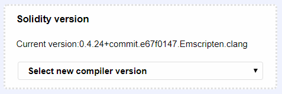

# Addendum: Solidity Version

The purpose of the addendum is to clarify the version of Solidity to use for your projects in Course 2 and Course 3.

Please understand that having different versions of software or programming language is a common practice in software development. Continuous improvement and version changes to reflect any significant improvements are to be expected especially in the context of an emerging technology such as the blockchain. For example, when I started recording the video, Solidity was in version 0.4.4; you might have observed this in the Course 2 demo videos.

So don't panic if you see some errors due to variations in version number. Follow the version we have specified. Then what is the version of Solidity to use for the course projects in Course 2 and Course 3, you may wonder? You can observe that the Course 2 project code is in version **0.4.17**, keep it that for the auto-grader to grade your solution correctly.

But then Remix IDE’s Solidity compiler is automatically set to the latest Solidity version. When you are working on the Remix for the Course 2 and Course 3, compiler version can be up to 0.4.21 MAX, not later than that. The instructions to change the compiler version in Remix are given below. Follow the instructions there to set the Solidity compiler version in Remix IDE. We will keep the compiler version at **0.4.17** to prevent any problems that may arise because of compiler issues.

Please refer the documentation for Solidity version 0.4.17 at [http://solidity.readthedocs.io/en/v0.4.17/](http://solidity.readthedocs.io/en/v0.4.17/) when developing your code.

Finally, please understand that you not only learned to code in Solidity but also learned how to adapt to the changes in the versions. The latter is an essential skill when working with any development, hardware or software.

Some of the changes in the newer version of Solidity are in the syntax of the constructor and the event feature. Please

1. Keep the constructor to be “function Auction” instead of newer version “constructor”
2. Call an event by its name (say, eventName) rather than “emit eventName” of the newer version of Solidity. It is not difficult to move to the newer version after you complete the course projects with version 0.4.17. You just have to pay attention to the errors and read the documentation.

Summarizing the addendum:

1. Keep the version of the Solidity code and compiler 0.4.17
2. Do not change the code except at the lines indicated; pay attention to the hints we have provided as comments embedded within the code.

Changing the compiler version in Solidity.

Go to **remix.ethereum.org**

Go to **Settings **tab

In Solidity Version, click on** Select new compiler version**

Select the following version **(0.4.17+commit.bdeb9e52)**

Before compiling the program, make sure the correct compiler version is selected!

Compile the program once again before the run.
